<picture>
  <source media="(prefers-color-scheme: dark)" srcset="assets/terminal-dark.svg">
  
</picture>

### Now

- **[speculate](https://github.com/lukebward/speculate)** — speculative prefetching for coding agents. Predicts your agent's next read-only MCP tool call and runs it early.
- **[pmox](https://github.com/lukebward/pmox)** — a friendly, AI-friendly CLI to explore and manage a Proxmox VE cluster.
- **[Ezmoji](https://github.com/lukebward/Ezmoji)** — system-wide `:emoji:` autocomplete for macOS. Type `:name`, hit Tab, get 🎉.

[luke-ward.com](https://luke-ward.com)

<!-- the old banner lives here now.

      ___  ___  ___                ___  _____ ______           ___       ___  ___  ___  __    _______
     |\  \|\  \|\  \              |\  \|\   _ \  _   \        |\  \     |\  \|\  \|\  \|\  \ |\  ___ \
     \ \  \\\  \ \  \             \ \  \ \  \\\__\ \  \       \ \  \    \ \  \\\  \ \  \/  /|\ \   __/|
      \ \   __  \ \  \  ___        \ \  \ \  \\|__| \  \       \ \  \    \ \  \\\  \ \   ___  \ \  \_|/__
       \ \  \ \  \ \  \|\  \        \ \  \ \  \    \ \  \       \ \  \____\ \  \\\  \ \  \\ \  \ \  \_|\ \
        \ \__\ \__\ \__\ \  \        \ \__\ \__\    \ \__\       \ \_______\ \_______\ \__\\ \__\ \_______\
         \|__|\|__|\|__|\/  /|        \|__|\|__|     \|__|        \|_______|\|_______|\|__| \|__|\|_______|
                      |\___/ /
                      \|___|/

you found it.
-->
